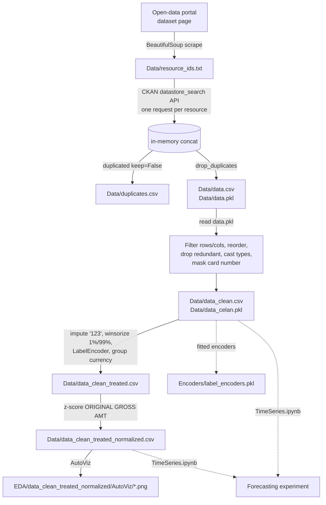

# Architecture – Data Pipeline

The project is a small, linear **batch data pipeline** made of three Python scripts and a set of notebooks. There are no services, classes, packages or layers; components communicate exclusively through **files on disk** under paths relative to the repository root.

## Components

| Component | Type | Role |
|---|---|---|
| `main.py` | Script (entry point) | Orchestrates extraction, then runs the transformation script via `runpy.run_path` |
| `data_extraction.py` | Module (3 functions) | Scrapes resource IDs, downloads each resource from the CKAN API, de-duplicates, saves |
| `EDA_and_Tranformations.py` | Script (exported notebook) | Cleans, transforms, encodes, normalizes, runs AutoViz |
| `Notebooks/EDA_and_Tranformations.ipynb` | Notebook | Original interactive version of the script above, with outputs |
| `Notebooks/Playground.ipynb` | Notebook | Prototype of the extraction logic + quick checks |
| `Notebooks/TimeSeries.ipynb` | Notebook | Forecasting experiment (not wired into `main.py`) |
| `Notebooks/Anomalies.ipynb` | Notebook (empty) | Placeholder for anomaly detection |

## Data flow

Dashed arrows are notebook-only paths that `main.py` does not execute.

## Execution sequence (`python main.py`)

1. `data_extraction.scrape_resource_ids(webpage_url, 'Data')` → list of IDs, written to `Data/resource_ids.txt`.
2. `data_extraction.fetch_and_save_data(resource_ids, 'Data')` → `Data/data.csv`, `Data/data.pkl`, `Data/duplicates.csv`.
3. `main.py` reloads `Data/data.pkl` and prints summary counts.
4. `runpy.run_path('EDA_and_Tranformations.py')` executes the whole transformation script top to bottom.
5. `MODEL TRAINING` section: empty.

## Coupling and constraints

- **Working directory:** every path is relative (`Data/…`, `EDA/…`, `Encoders/…`, `EDA_and_Tranformations.py`). The pipeline only works when launched from the repository root. This is why the reorganization kept these folders and scripts in place.
- **Pickle hand-off:** step 4 reads `Data/data.pkl`, which is git-ignored; it must be produced by step 2 first.
- **Full re-download:** there is no caching or incremental mode; every run re-downloads all resources.
- **In-memory processing:** the whole dataset (~300k rows × 63 columns) is processed with pandas in memory.

## Out of scope / not present

No database, web service, API, scheduler, CLI arguments, configuration files, tests or packaging exist in the original project.
